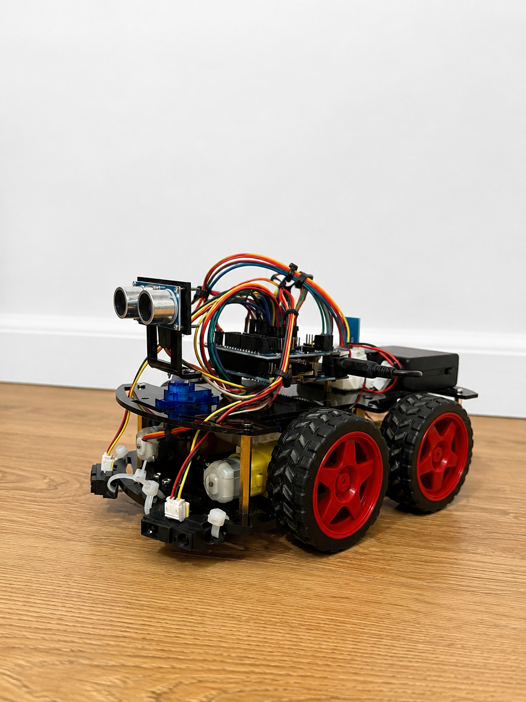
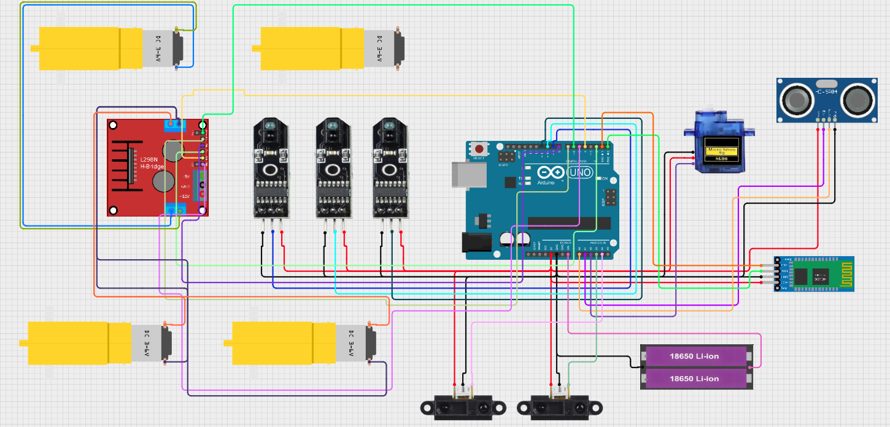

# Arduino Uno-Based 4WD Intelligent Robot

An Arduino Uno-based 4WD mobile robot designed and implemented to operate in three different modes: **Bluetooth manual control, autonomous obstacle avoidance, and line following**.

The project integrates multiple sensors and control strategies into a single low-cost robotic platform. During manual Bluetooth control, an additional safety system automatically prevents the robot from moving into detected obstacles.

## Features

* Bluetooth-based manual control using the **HC-06 Bluetooth module**
* Autonomous obstacle detection and avoidance
* Line following using **TCRT5000 infrared sensors**
* Front distance measurement using an **HC-SR04 ultrasonic sensor**
* Side obstacle detection using **two Sharp GP2Y0A21 infrared distance sensors**
* Automatic collision prevention during manual control
* Three operating modes integrated into a single system
* Software-based switching between operating modes through Bluetooth commands
* Safety timeout that automatically stops the robot if control commands are interrupted
* Basic environment scanning using front and side distance sensors

## Hardware

The main components used in the project include:

* Arduino Uno
* 4WD robotic chassis with four DC motors
* Motor driver
* HC-06 Bluetooth module
* HC-SR04 ultrasonic sensor
* 2 × Sharp GP2Y0A21 infrared distance sensors
* 3 × TCRT5000 infrared sensors for line tracking
* Battery/power supply

## Operating Modes

### 1. Bluetooth Manual Control

The robot can be controlled wirelessly through the HC-06 Bluetooth module. Commands allow the operator to control the movement and direction of the robot.

A safety mechanism is also active during manual operation. When the robot detects an obstacle while moving forward, it can automatically prevent a collision even if the operator continues sending a forward command.

During experimental testing, Bluetooth communication remained stable without interruptions at distances of up to approximately **8 meters**.

### 2. Autonomous Obstacle Avoidance

In this mode, the robot navigates autonomously using three distance sensors.

The **HC-SR04 ultrasonic sensor** monitors the area in front of the robot, while two **Sharp GP2Y0A21 sensors** monitor obstacles on its sides.

During testing:

* The robot successfully reacted to front obstacles at approximately **20 cm**.
* The side sensors reacted to obstacles at approximately **6 cm**.
* The combination of front and side sensing reduced blind spots and allowed the robot to avoid collisions successfully.

A blocked-direction memory mechanism is implemented to reduce repeated turns toward recently detected obstacles.

### 3. Line Following

Three TCRT5000 infrared sensors are used to detect and follow a line.

The robot successfully followed straight sections of the test path. It was also able to recover the line in curves, although with reduced speed and accuracy. The experimental results indicated that sensor sensitivity was the main limitation affecting smooth movement through curves.

## Experimental Results

Testing demonstrated reliable operation of all three implemented modes.

The **obstacle avoidance mode showed the strongest overall performance**, successfully combining front and side sensor information to navigate without collisions.

Bluetooth control provided fast and reliable response, while command timeout mechanisms automatically stopped the robot when new movement commands were not received within the defined time.

Line following performed reliably on straight paths but showed reduced responsiveness on curves.

## Future Improvements

Possible improvements to the system include:

* Replacing the three TCRT5000 sensors with a dedicated line-following array containing five or more sensors
* Implementing a **PID control algorithm** for smoother and more precise line following
* Replacing the HC-06 Bluetooth module with an HC-05 or Wi-Fi-based communication module
* Improving sensor accuracy and reaction speed during sharp curves

## Source Code

The complete Arduino source code for the robot is available in:

`4WD_FINISHED.ino`

## Project Prototype

The following image shows the final implemented 4WD robotic platform.

## Circuit Diagram

The final circuit diagram of the implemented system is shown below.

